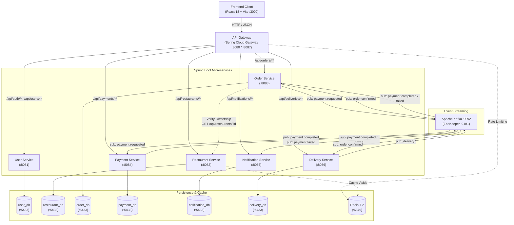
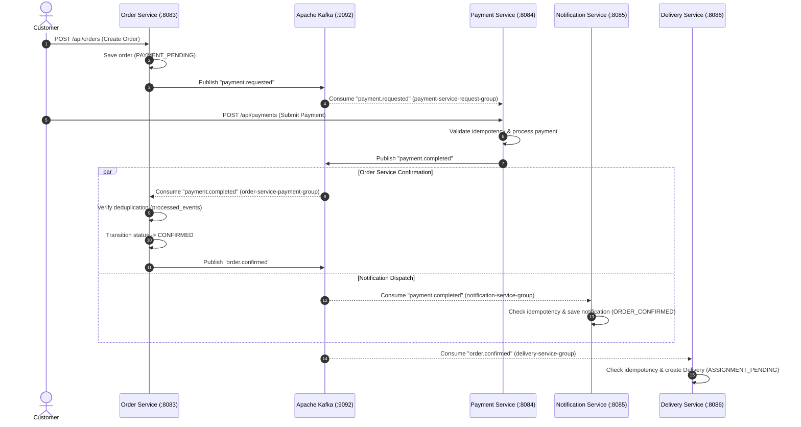
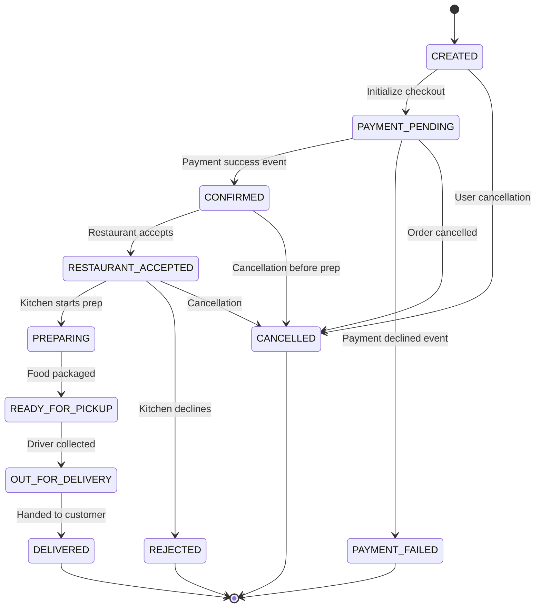

# FoodFlow

Distributed Food Ordering System built with Spring Boot microservices, Kafka, PostgreSQL, Redis, JWT authentication, and an API Gateway.

---

## Overview

**FoodFlow** is a distributed, event-driven food ordering and delivery management platform. It addresses the end-to-end lifecycle of an online food delivery ecosystem: customer identity, restaurant cataloging, menu administration, order placement, simulated payment transactions, notification dispatching, and courier dispatch/fulfillment.

Modern food delivery platforms operate under high concurrency with asynchronous workflows across independent business domains. Monolithic architectures often suffer from tight database coupling, cascading failure vulnerabilities, and operational bottlenecks across disparate domains (such as order ingestion versus delivery tracking). FoodFlow decomposes these domains into bounded contexts following microservice architecture principles, providing:

- **Domain Isolation:** Six dedicated Spring Boot microservices and an API Gateway, each owning its business logic and data store.
- **Database-per-Service:** Independent PostgreSQL databases eliminate cross-domain schema coupling and ensure independent scalability.
- **Event-Driven Asynchronous Processing:** Apache Kafka decouples payment confirmation, order lifecycle progression, delivery creation, and customer notifications.
- **Cache-Aside Performance:** Redis provides low-latency caching for read-heavy restaurant data with graceful degradation on cache unavailability.
- **Decentralized Security:** Stateless JWT authentication with Role-Based Access Control (RBAC) and domain-level entity ownership verification across downstream services.
- **Resilience and Concurrency Controls:** Optimistic locking for concurrent courier assignment, idempotency keys for payment processing, and event deduplication tables.

---

## Key Features

### Authentication & Authorization
- User registration and login with encrypted password storage via BCrypt.
- Stateless JSON Web Token (JWT) issuance with embedded claims (`userId`, `role`, `sub`).
- Role-Based Access Control (RBAC) supporting four distinct system roles: `CUSTOMER`, `RESTAURANT_OWNER`, `DELIVERY_PARTNER`, and `ADMIN`.
- Downstream method-level authorization (`@PreAuthorize`) enforcing role boundaries and entity ownership.
- Indian mobile number validation enforcing exactly 10 digits (`^\d{10}$`) on frontend and backend.

### Customer Operations
- Restaurant discovery and menu catalog browsing.
- Client-side shopping cart management with quantity adjustment and dish persistence.
- Order creation with order item snapshots, pricing calculations, and delivery address capture.
- Simulated payment processing with unique idempotency keys.
- Real-time customer order history and order tracking page with delivery progress indicators.
- Customer-scoped notification inbox displaying order and payment event updates.

### Restaurant & Menu Management
- Restaurant profile registration, metadata updates, and operating status toggle (`OPEN` / `CLOSED`).
- Menu item management: dish creation, description, pricing, and availability toggle (`In Stock` / `Out of Stock`).
- Multi-tenant ownership verification ensuring restaurant owners can only modify their own venues and menus.

### Order Processing & State Machine
- Strict state-machine validation governing the end-to-end order lifecycle.
- Idempotent handling of same-state transitions without duplicate database writes or event side effects.
- Clean rejection of skipped or illegal status transitions with descriptive HTTP 400 Bad Request responses.

### Payment Processing
- Idempotent payment execution using client-supplied `Idempotency-Key` headers.
- Simulated payment rules (e.g., transactions exceeding ₹5000 fail; normal amounts succeed).
- Asynchronous Kafka event publishing (`payment.completed` and `payment.failed`) decoupling payment completion from order fulfillment.

### Delivery Management
- Automatic delivery record generation upon order confirmation via Kafka.
- Courier console to search deliveries, inspect delivery tasks, and claim available orders.
- Optimistic locking (`@Version`) on delivery partner profiles to prevent race conditions during concurrent assignment.
- Step-by-step courier fulfillment state machine: `ASSIGNED` → `PICKED_UP` → `OUT_FOR_DELIVERY` → `DELIVERED`.

### Notification Service
- Asynchronous consumption of payment events from Kafka.
- Persistence of user-scoped and order-scoped notification audit records.
- Simulated notification dispatching with structured event identifiers.

### Administration
- Dedicated System Administrator console.
- Delivery fleet registration and courier profile onboarding.
- Administrative order status override control with state validation and missing-order handling.

### Routing & Traffic Management
- Centralized Spring Cloud Gateway entry point routing traffic to all microservices.
- Request correlation tracking via `X-Correlation-Id` header propagation.
- Redis-backed rate limiting on authentication endpoints (`/api/auth/login`) using the Token Bucket algorithm.

---

## Architecture

FoodFlow adopts a microservices architecture with an API Gateway facade, service-level database isolation, and Kafka event choreographies for asynchronous workflows.



---

## Microservices

| Service | Primary Responsibility | Port | Persistence / Storage | Inter-Service Communication |
| :--- | :--- | :---: | :--- | :--- |
| **api-gateway** | Single ingress point, reverse proxy, route dispatching, request rate limiting, correlation ID tagging | `8080` *(or `8087` fallback)* | Redis (`6379`) | Synchronous HTTP forward to downstream microservices |
| **user-service** | User registration, credential authentication, BCrypt hashing, JWT generation | `8081` | PostgreSQL: `user_db` | Direct HTTP response to Gateway |
| **restaurant-service** | Restaurant catalogs, menu items, availability status, owner authorization | `8082` | PostgreSQL: `restaurant_db`, Redis cache | Synchronous HTTP calls from `order-service` |
| **order-service** | Order creation, total calculation, lifecycle state machine, event deduplication | `8083` | PostgreSQL: `order_db` | Publishes `payment.requested`, `order.confirmed`; consumes `payment.completed`, `payment.failed`; synchronous HTTP to `restaurant-service` |
| **payment-service** | Payment execution, idempotency verification, simulated transaction gateway | `8084` | PostgreSQL: `payment_db` | Consumes `payment.requested`; publishes `payment.completed`, `payment.failed` |
| **notification-service** | Event notification persistence, user/order notification history, mock notification dispatch | `8085` | PostgreSQL: `notification_db` | Consumes `payment.completed`, `payment.failed` |
| **delivery-service** | Delivery records, driver pool management, optimistic lock assignment, transit progression | `8086` | PostgreSQL: `delivery_db` | Consumes `order.confirmed`; publishes `delivery.<status>` events |

---

## Technology Stack

| Category | Technologies |
| :--- | :--- |
| **Backend Framework** | Java 17, Spring Boot 3.3.4, Spring Data JPA, Spring Security 6, Spring Cloud Gateway 2023.0.3 |
| **Database** | PostgreSQL 15 (Docker container `foodflow-postgres`, host port `5433`) |
| **Messaging & Events** | Apache Kafka 7.4.4 (`foodflow-kafka` :9092), Confluent ZooKeeper 7.4.4 (`foodflow-zookeeper` :2181) |
| **In-Memory Cache** | Redis 7.2 Alpine (`foodflow-redis` :6379), Spring Data Redis, Lettuce Client |
| **Security & Auth** | JSON Web Tokens (`jjwt-api` / `jjwt-impl` 0.12.5), BCrypt password hashing |
| **Frontend** | React 18, TypeScript, Vite 5.4, React Router DOM 6, Axios |
| **Build Tools** | Apache Maven 3.x (Multi-module root POM), npm / Node.js |
| **Containerization** | Docker Engine, Docker Compose v2 |
| **Testing & Scripts** | PowerShell automated test suites, REST client verification scripts, Python E2E harness |

---

## Authentication & Authorization

FoodFlow implements a stateless, decentralized JWT security model across all microservices.

### Registration & Login Workflow
1. Client submits credentials to `POST /api/auth/register` or `POST /api/auth/login`.
2. The `user-service` validates inputs, hashes passwords with `BCryptPasswordEncoder`, and authenticates credentials.
3. Upon success, `user-service` generates a signed HMAC-SHA256 JWT using a shared secret key (`JWT_SECRET`).
4. The JWT contains standard and custom claims:
   - `sub`: User email address
   - `userId`: Numeric unique user identifier
   - `role`: Prefixed authority name (e.g., `ROLE_CUSTOMER`, `ROLE_RESTAURANT_OWNER`, `ROLE_DELIVERY_PARTNER`, `ROLE_ADMIN`)
   - `iat`: Issue timestamp
   - `exp`: Expiration timestamp (24-hour validity)

### Downstream Token Validation
- The **API Gateway** acts as a reverse proxy and rate limiter; it forwards the `Authorization: Bearer <token>` header downstream without decoding or mutating it.
- Each downstream microservice incorporates a dedicated `JwtAuthenticationFilter` (extending `OncePerRequestFilter`).
- The filter extracts the Bearer token, validates the signature against `${JWT_SECRET}`, extracts `userId` and `role`, and sets a `UsernamePasswordAuthenticationToken` in Spring Security's `SecurityContextHolder`.

### Role-Based Access Control (RBAC) & Ownership Enforcement
- Endpoints use declarative `@PreAuthorize` expressions. Examples:
  - `@PreAuthorize("hasRole('ROLE_CUSTOMER') or hasRole('ROLE_RESTAURANT_OWNER')")` for placing and fetching orders.
  - `@PreAuthorize("hasRole('ROLE_RESTAURANT_OWNER')")` for managing restaurant menus.
  - `@PreAuthorize("hasRole('ROLE_DELIVERY_PARTNER')")` for claiming and advancing deliveries.
  - `@PreAuthorize("hasRole('ROLE_ADMIN')")` for registering delivery partners and overriding order states.
- Domain ownership checks verify that authenticated users cannot access or alter resources belonging to other users:
  - `notification-service`: `@PreAuthorize("#userId == authentication.principal or hasRole('ROLE_ADMIN')")` prevents customers from reading other users' notifications.
  - `restaurant-service`: Checks `restaurant.getOwnerId().equals(callerUserId)`.
  - `order-service`: When updating order status, validates restaurant ownership via a synchronous HTTP call to `restaurant-service` before processing.

---

## Event-Driven Architecture

Microservices coordinate state transitions and downstream side effects through Apache Kafka topics.



### Kafka Topics and Consumer Groups

| Topic Name | Producer Service | Consumer Service | Consumer Group | Description |
| :--- | :--- | :--- | :--- | :--- |
| `payment.requested` | `order-service` | `payment-service` | `payment-service-request-group` | Emitted when an order is created, notifying payment service of pending balance. |
| `payment.completed` | `payment-service` | `order-service`<br>`notification-service` | `order-service-payment-group`<br>`notification-service-group` | Emitted upon successful payment. Triggers order confirmation and customer notification. |
| `payment.failed` | `payment-service` | `order-service`<br>`notification-service` | `order-service-payment-group`<br>`notification-service-group` | Emitted when payment fails. Updates order to `PAYMENT_FAILED` and alerts the customer. |
| `order.confirmed` | `order-service` | `delivery-service` | `delivery-service-group` | Emitted after order payment is confirmed. Initializes a new delivery record. |
| `delivery.<status>` | `delivery-service` | *(Internal/Future)* | — | Emitted when a delivery advances (`assigned`, `picked_up`, `out_for_delivery`, `delivered`). |

### Event Deduplication & Idempotency
- **Order Service:** Persists received event IDs in a `processed_events` table. If `processedEventRepository.existsById(event.getEventId())` returns true, the event is safely skipped.
- **Notification Service:** Leverages `existsByEventId(eventId)` and a unique database constraint on `event_id` in `notifications` to drop duplicate events.
- **Delivery Service:** Leverages `existsByEventId(eventId)` and a unique constraint on `event_id` in `deliveries` to avoid duplicate delivery task generation.

---

## Order Lifecycle & State Machine

Orders follow an explicit state transition machine managed in `OrderService.java`.



### Transition Validation Rules
1. **Valid Transitions:** Only direct, sequential next-state moves are permitted according to business logic.
2. **Invalid / Skipped Transitions:** Attempting an illegal skip (e.g., `CONFIRMED` → `DELIVERED`) throws `InvalidOrderStateException` and returns HTTP **400 Bad Request** with an explicit error message (`"Invalid transition from CONFIRMED to DELIVERED"`).
3. **Same-State Transitions:** Submitting an update where `newStatus == order.getStatus()` is handled as a safe **idempotent no-op** returning HTTP 200 without database updates, timestamp modifications, or Kafka event generation.
4. **Terminal States:** Once an order reaches `DELIVERED`, `PAYMENT_FAILED`, `REJECTED`, or `CANCELLED`, all further transitions are prohibited.

---

## Data & Database Design

FoodFlow follows the **Database-per-Service** pattern. Each microservice connects exclusively to its isolated PostgreSQL database hosted on container `foodflow-postgres` (host port `5433`).

```
PostgreSQL Instance (localhost:5433)
├── user_db          -> users
├── restaurant_db    -> restaurants, menu_items
├── order_db         -> orders, order_items, processed_events
├── payment_db       -> payments
├── notification_db  -> notifications
└── delivery_db      -> deliveries, delivery_partners
```

### Key Schema Entities

- **`user_db`:**
  - `users`: Primary key `id`, `name`, `email` (unique), `password` (BCrypt hash), `phone` (10 digits), `role` (`CUSTOMER`, `RESTAURANT_OWNER`, `DELIVERY_PARTNER`, `ADMIN`), audit timestamps.
- **`restaurant_db`:**
  - `restaurants`: Primary key `id`, `owner_id`, `name`, `description`, `address`, `is_open`, audit timestamps.
  - `menu_items`: Primary key `id`, `restaurant_id` (foreign key), `name`, `description`, `price`, `available`.
- **`order_db`:**
  - `orders`: Primary key `id`, `user_id`, `restaurant_id`, `total_amount`, `status`, `delivery_address`, audit timestamps.
  - `order_items`: Primary key `id`, `order_id` (foreign key), `menu_item_id`, `quantity`, `price`.
  - `processed_events`: Primary key `event_id`, `processed_at` (used for Kafka deduplication).
- **`payment_db`:**
  - `payments`: Primary key `id`, `order_id`, `user_id`, `amount`, `status`, `idempotency_key` (unique), `reference_number`, audit timestamps.
- **`notification_db`:**
  - `notifications`: Primary key `id`, `user_id`, `order_id`, `type`, `message`, `status`, `event_id` (unique), audit timestamps.
- **`delivery_db`:**
  - `deliveries`: Primary key `id`, `order_id`, `restaurant_id`, `delivery_partner_id`, `status`, `event_id` (unique), audit timestamps.
  - `delivery_partners`: Primary key `id`, `name`, `status` (`AVAILABLE`, `BUSY`), `version` (optimistic lock field).

---

## Caching Strategy

Redis is utilized for high-frequency reads and traffic management:

### 1. Restaurant Metadata Cache (Cache-Aside Pattern)
In `restaurant-service`:
- **Read Path (`getRestaurant`):** Queries Redis key `restaurant:{id}`. On cache hit, deserializes and returns cached `RestaurantDto`. On cache miss, fetches from PostgreSQL `restaurant_db`, populates Redis with a 10-minute TTL, and returns the result.
- **Write Path / Invalidation (`updateRestaurant`, `toggleStatus`):** When restaurant details or operating statuses are modified by the owner, `RestaurantService` updates the database and immediately overwrites/refreshes the cached key `restaurant:{id}`.
- **Resilience / Fallback:** `RedisConfig` implements a custom `CacheErrorHandler`. If Redis is temporarily unreachable, queries log a warning and fall back transparently to PostgreSQL without interrupting customer traffic.

### 2. Login Rate Limiting (Token Bucket Algorithm)
In `api-gateway`:
- The gateway leverages Spring Cloud Gateway's `RequestRateLimiter` backed by Redis.
- Configured on `/api/auth/login` using `IpKeyResolver` to resolve client IP addresses:
  - `redis-rate-limiter.replenishRate: 5`
  - `redis-rate-limiter.burstCapacity: 10`

---

## Payment Flow

Payment processing simulates real-world payment gateway interactions:

1. **Order Checkout:** When customer calls `POST /api/orders`, the order is saved in `PAYMENT_PENDING` status, and an event is emitted on `payment.requested`.
2. **Payment Submission:** Customer submits `POST /api/payments` with an `Idempotency-Key` header, `orderId`, and `amount`.
3. **Idempotency Verification:** If a duplicate request with the same `Idempotency-Key` is received, `payment-service` returns the existing payment record without duplicate processing.
4. **Transaction Simulation Rules:**
   - Amounts $\le$ ₹5000: Result is marked `SUCCESS`.
   - Amounts $>$ ₹5000: Result is marked `FAILED` (simulating card/balance threshold decline).
5. **Event Emission:**
   - On success: Emits `payment.completed` with `eventId`, `orderId`, `userId`, `amount`, and `status`.
   - On failure: Emits `payment.failed` with `eventId`, `orderId`, `userId`, `failureReason`.
6. **Downstream Side Effects:**
   - `order-service` consumes the event, updates order to `CONFIRMED`, and publishes `order.confirmed`.
   - `notification-service` consumes the event, creates a customer-visible notification record, and triggers a mock notification dispatcher.
   - `delivery-service` consumes `order.confirmed` and creates a delivery record ready for courier assignment.

---

## API Gateway

The API Gateway is built on **Spring Cloud Gateway (Reactive / Spring WebFlux)** running on port `8080` (with dynamic fallback to `8087` if port 8080 is bound by existing host containers).

### Route Dispatching Table

| Ingress Route Predicate | Destination Microservice | Filters / Features |
| :--- | :--- | :--- |
| `/api/auth/login` | `http://localhost:8081` (`user-service`) | Redis-backed RequestRateLimiter (5 req/s, burst 10) |
| `/api/auth/**`, `/api/users/**` | `http://localhost:8081` (`user-service`) | Correlation ID injection, CORS |
| `/api/restaurants/**` | `http://localhost:8082` (`restaurant-service`) | Correlation ID injection, CORS |
| `/api/orders/**` | `http://localhost:8083` (`order-service`) | Correlation ID injection, CORS |
| `/api/payments/**` | `http://localhost:8084` (`payment-service`) | Correlation ID injection, CORS |
| `/api/notifications/**` | `http://localhost:8085` (`notification-service`) | Correlation ID injection, CORS |
| `/api/deliveries/**` | `http://localhost:8086` (`delivery-service`) | Correlation ID injection, CORS |

### Gateway Filters
- **CorrelationIdFilter:** Checks each inbound HTTP request for the header `X-Correlation-Id`. If missing, generates a `UUID` and attaches it to downstream request headers and client response headers.
- **LoggingFilter:** Structured access logging recording method, path, and HTTP status codes.

---

## Error Handling & Validation

FoodFlow provides standardized error responses across all microservices:

- **Centralized Exception Handling:** Each service includes a `@ControllerAdvice` `GlobalExceptionHandler` mapping exceptions to structured JSON payloads (`status`, `message`, `timestamp`).
- **Standardized Status Codes:**
  - `400 Bad Request`: Input validation failures (`MethodArgumentNotValidException`), type mismatches, and invalid state transitions (`InvalidOrderStateException`).
  - `401 Unauthorized`: Missing or expired JWT credentials, invalid login credentials.
  - `403 Forbidden`: Insufficient role permissions (`AccessDeniedException`) or resource ownership mismatches.
  - `404 Not Found`: Nonexistent resources (`ResourceNotFoundException`).
  - `409 Conflict`: Duplicate resources (`DuplicateResourceException`) or idempotency constraint clashes.
- **Frontend Error Normalization:** The Axios HTTP client interceptor (`client.ts`) unpacks backend error structures, extracting field validation maps (e.g., `{"phone": "Phone number must be exactly 10 digits."}`) and returning readable user notifications.

---

## Project Structure

```
Food_Distributed_System/
├── api-gateway/                      # Spring Cloud Gateway (Port 8080 / 8087)
│   └── src/main/java/com/foodflow/gateway/
├── user-service/                     # Identity & Authentication Service (Port 8081)
│   └── src/main/java/com/foodflow/user/
├── restaurant-service/               # Restaurant & Menu Service (Port 8082)
│   └── src/main/java/com/foodflow/restaurant/
├── order-service/                    # Order Management & State Machine (Port 8083)
│   └── src/main/java/com/foodflow/order/
├── payment-service/                  # Idempotent Payment Simulator (Port 8084)
│   └── src/main/java/com/foodflow/payment/
├── notification-service/             # Notification Event Consumer (Port 8085)
│   └── src/main/java/com/foodflow/notification/
├── delivery-service/                 # Courier & Delivery Management (Port 8086)
│   └── src/main/java/com/foodflow/delivery/
├── frontend/                         # React 18 + Vite + TypeScript (Port 3000)
│   ├── src/
│   │   ├── api/                      # Axios API clients & error handlers
│   │   ├── components/               # Navbar, Footer, Modal, ProtectedRoute
│   │   ├── context/                  # AuthContext, CartContext
│   │   └── pages/                    # Customer, Owner, Driver, Admin pages
│   ├── package.json
│   └── vite.config.ts
├── docs/                             # Architecture & system design documentation
├── docker-compose.yml                # PostgreSQL (:5433), Redis (:6379), Kafka (:9092), ZooKeeper (:2181)
├── init.sql                          # Database initialization script
├── start-services.ps1                # Automated PowerShell backend launcher with health probes
├── stop-services.ps1                 # Process terminator for microservice ports
├── gateway-test.ps1                  # API Gateway end-to-end integration test script
├── pom.xml                           # Root Maven multi-module parent POM
├── .env.example                      # Environment variables configuration template
└── README.md                         # Project documentation
```

---

## Running the Project Locally

### Prerequisites
- **Java:** JDK 17 (or higher)
- **Maven:** 3.8+ (accessible via `mvn`)
- **Node.js:** v18+ and `npm`
- **Docker Desktop:** Running with Docker Compose v2 support
- **PowerShell:** Version 5.1+ (Windows)

---

### Step 1: Environment Configuration
Copy `.env.example` to create a local `.env` file in the project root:

```powershell
Copy-Item .env.example .env
```

Configure your secure credentials in `.env`:
```env
# Database Credentials
DB_USER=foodflow
DB_PASSWORD=your_secure_database_password_here
DB_HOST=localhost
DB_PORT=5433

# JWT Secret (Base64-encoded HMAC-SHA256 secret key, minimum 256 bits)
JWT_SECRET=FoodFlowDevSecretKey2026VeryLongSecureSecret123456789

# Infrastructure
REDIS_HOST=localhost
REDIS_PORT=6379
KAFKA_BOOTSTRAP_SERVERS=localhost:9092

# Service URLs
USER_SERVICE_URL=http://localhost:8081
RESTAURANT_SERVICE_URL=http://localhost:8082
ORDER_SERVICE_URL=http://localhost:8083
PAYMENT_SERVICE_URL=http://localhost:8084
NOTIFICATION_SERVICE_URL=http://localhost:8085
DELIVERY_SERVICE_URL=http://localhost:8086

# Gateway Port (Default 8080; use 8087 if 8080 is bound)
GATEWAY_PORT=8080
VITE_API_BASE_URL=http://localhost:8080
```

> **Security Notice:** Never commit `.env` containing real passwords or keys to Git. The `.gitignore` file excludes `.env`.

---

### Step 2: Start Infrastructure Containers
Launch PostgreSQL, Redis, Kafka, and ZooKeeper using Docker Compose:

```powershell
docker compose up -d
```

Verify that all four containers are running and healthy:
```powershell
docker compose ps
```
- `foodflow-postgres`: Port `5433` -> `5432`
- `foodflow-redis`: Port `6379` -> `6379`
- `foodflow-kafka`: Port `9092` -> `9092`
- `foodflow-zookeeper`: Port `2181` -> `2181`

---

### Step 3: Compile and Package the Backend
Build all 7 microservices using Maven:

```powershell
mvn clean package -DskipTests
```

---

### Step 4: Launch Microservices
Start all backend services in the background using the provided launcher:

```powershell
.\start-services.ps1
```

The script automatically:
1. Loads `.env` variables and validates required secrets.
2. Checks connectivity to PostgreSQL (5433), Redis (6379), and Kafka (9092).
3. Verifies that all target JAR files exist.
4. Detects port availability (uses port `8080` for API Gateway, or falls back to `8087` if 8080 is occupied).
5. Launches all 7 microservices and monitors their Actuator health endpoints until healthy.

To stop all running microservices:
```powershell
.\stop-services.ps1
```

---

### Step 5: Start the Frontend Application
Navigate to the `frontend/` directory, install dependencies, and run the Vite dev server:

```powershell
cd frontend
npm install
npm run dev
```

Open your browser at:
```
http://localhost:3000
```

---

## Testing & Verification

The repository contains automated verification scripts and regression suites:

- **E2E Gateway Test:**
  ```powershell
  .\gateway-test.ps1
  ```
  Tests registration, JWT authorization, protected restaurant creation, order placement, and gateway routing.

- **Microservice Verification Scripts:**
  - `.\verify-payment-service.ps1`: Verifies payment idempotency and event generation.
  - `.\verify-notification-service.ps1`: Verifies Kafka event consumption and notification persistence.
  - `.\verify-delivery-service.ps1`: Verifies driver assignment and fulfillment lifecycle.
  - `.\verify-api-gateway.ps1`: Verifies reverse proxy routes and rate-limiting behaviors.

- **Full Regression Test Suite:**
  An end-to-end Python test suite covers 34 distinct assertions spanning mobile number validation, owner dashboard workflows, customer checkout, Kafka event choreography, order state machine boundaries, 404 handling, courier claiming, and RBAC security rules.

---

## Security Considerations

1. **Stateless JWT Tokens:** User authentication state is never stored in server memory. Services validate tokens locally using the shared HMAC secret.
2. **Password Security:** All passwords are salted and hashed using Spring Security's `BCryptPasswordEncoder` prior to persistence.
3. **Role-Based Authorization:** Every mutating endpoint enforces RBAC boundaries at the method level using `@PreAuthorize`.
4. **Tenant & Resource Ownership:** Entities (restaurants, menus, orders, notifications) verify ownership against `authentication.principal` to prevent Insecure Direct Object References (IDOR).
5. **No Committed Secrets:** Passwords and keys are externalized into environment variables via `.env`.

---

## Engineering Decisions

- **Database-per-Service:** Enforces loose coupling. A schema migration in `order-service` cannot break `restaurant-service` or lock tables in `user-service`.
- **Event-Driven Choreography over Orchestration:** Uses Kafka events (`payment.completed`, `order.confirmed`) to propagate state asynchronously. This prevents long-lived distributed transactions and avoids single points of failure.
- **Cache-Aside with Graceful Fallback:** Protects `restaurant-service` against database bottlenecks during peak browsing hours while maintaining service uptime even if Redis fails.
- **Optimistic Locking on Deliveries:** Prevents race conditions when multiple couriers attempt to accept the same delivery simultaneously without requiring heavy distributed locks.
- **Downstream JWT Validation:** Avoids placing full security coupling solely on the API Gateway, ensuring microservices remain secure even if called in internal network topographies.

---

## Future Improvements

- **Distributed Tracing:** Integrate OpenTelemetry / Micrometer Tracing with Zipkin or Jaeger for distributed trace visualization across HTTP and Kafka hops.
- **Service Discovery:** Introduce Spring Cloud Netflix Eureka or HashiCorp Consul for dynamic service registration.
- **Production Payment Gateway:** Integrate Stripe or Razorpay webhooks and payment intent APIs.
- **Containerized Deployment:** Create Kubernetes manifests (Deployments, Services, ConfigMaps, Ingress) or Helm charts.
- **Dead-Letter Topics (DLT):** Implement error handling and dead-letter topics for poisoned Kafka messages.


