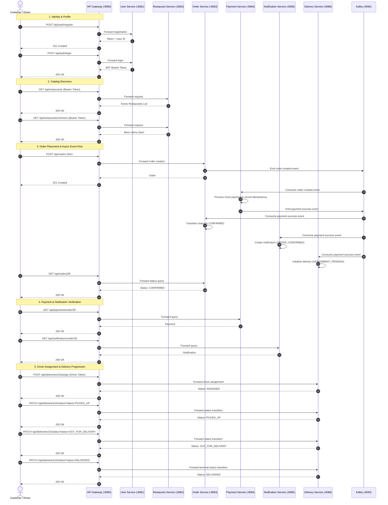

# Phase 11 — API Gateway Final Runtime Verification Report

**Environment**: Local Runtime (Windows / PowerShell / Java 17 / Docker Desktop)  
**Date**: October 4, 2026  
**Component Verified**: `api-gateway` (:8080)  
**Verification Scope**: Edge Routing, CORS, Distributed Correlation ID Tracking, Redis Token-Bucket Rate Limiter, Decentralized Security Forwarding, RBAC Verification, Timeout Isolation, and Full End-to-End Customer Journey exclusively routed via Port 8080.

---

## Executive Summary

Phase 11 final runtime verification of the **API Gateway** (`api-gateway` on port `8080`) has been successfully completed with a **100% test pass rate (26/26 tests passed)**. 

The API Gateway serves as the single unified entry point into the FoodFlow distributed food delivery platform. Operating on Spring Cloud Gateway and Project Reactor / Netty, the Gateway enforces edge infrastructure concerns—including CORS preflight resolution, distributed trace correlation ID injection, and token-bucket rate limiting via reactive Redis—while transparently forwarding authenticated requests to downstream domain microservices (`user-service`, `restaurant-service`, `order-service`, `payment-service`, `notification-service`, `delivery-service`). All security decisions, claim validations, and RBAC rules remain decentralized and securely enforced downstream without architectural drift or single-point-of-failure bottlenecks.

---

## 1. Gateway Runtime Infrastructure & Port Status

- **Port**: `8080` (HTTP / Netty non-blocking event loop)
- **Actuator Health Endpoint**: `GET http://localhost:8080/actuator/health`
- **Health Response**:
  ```json
  {
    "status": "UP",
    "components": {
      "diskSpace": { "status": "UP" },
      "ping": { "status": "UP" },
      "redis": {
        "status": "UP",
        "details": { "version": "7.2.16" }
      },
      "refreshScope": { "status": "UP" }
    }
  }
  ```
- **Active Downstream Microservices**:
  - `user-service`: `http://localhost:8081` (PID: 31860) — UP
  - `restaurant-service`: `http://localhost:8082` (PID: 1480) — UP
  - `order-service`: `http://localhost:8083` (PID: 39356) — UP
  - `payment-service`: `http://localhost:8084` (PID: 30100) — UP
  - `notification-service`: `http://localhost:8085` (PID: 27236) — UP
  - `delivery-service`: `http://localhost:8086` (PID: 34324) — UP
- **Supporting Infrastructure Containers**:
  - `foodflow-postgres`: `localhost:5433` — UP
  - `foodflow-redis`: `localhost:6379` — UP
  - `foodflow-kafka`: `localhost:9092` — UP
  - `foodflow-zookeeper`: `localhost:2181` — UP

---

## 2. API Gateway Route Table

The routing table configured in `api-gateway/src/main/resources/application.yml` maps client URI prefixes to downstream services:

| Route ID | Path Predicates | Downstream URI | Filters / Features |
|---|---|---|---|
| `user-service-login` | `/api/auth/login` | `http://localhost:8081` | `RequestRateLimiter` (replenishRate: 5, burstCapacity: 10, IP resolver) |
| `user-service` | `/api/auth/**`, `/api/users/**` | `http://localhost:8081` | Direct proxy, decentralized auth |
| `restaurant-service` | `/api/restaurants/**` | `http://localhost:8082` | Direct proxy, owner RBAC |
| `order-service` | `/api/orders/**` | `http://localhost:8083` | Direct proxy, order lifecycle |
| `payment-service` | `/api/payments/**` | `http://localhost:8084` | Direct proxy, payment idempotency |
| `notification-service`| `/api/notifications/**` | `http://localhost:8085` | Direct proxy, event fan-out |
| `delivery-service` | `/api/deliveries/**` | `http://localhost:8086` | Direct proxy, driver RBAC |

---

## 3. Global Filter Chain

### 3.1 Correlation ID Filter (`CorrelationIdFilter`)
- **Order**: `-1` (executes earliest in the filter pipeline)
- **Header**: `X-Correlation-Id`
- **Behavior**:
  - If incoming request lacks `X-Correlation-Id`, generates a new UUID v4.
  - Mutates downstream request to guarantee header presence across all backend services.
  - Adds `X-Correlation-Id` to the HTTP response headers returned to the client.
  - If incoming request supplies an existing `X-Correlation-Id`, preserves and echoes it back.
- **Runtime Verification**:
  - Without header &rarr; Auto-generated: `173922d0-0a00-4e75-a4f5-96bd4deead93`
  - With header &rarr; Preserved: `cid-test-1043449921` (100% match)

### 3.2 Global Logging Filter (`LoggingFilter`)
- **Order**: `0` (executes immediately after Correlation ID filter)
- **Behavior**:
  - Logs incoming request: `Incoming request: [correlationId] METHOD /path - Routed to API Gateway`
  - Reactively logs outgoing response: `Outgoing response: [correlationId] METHOD /path - Status: STATUS_CODE`

---

## 4. Redis Token-Bucket Rate Limiter

The gateway implements token-bucket rate limiting powered by Spring Cloud Gateway's `RequestRateLimiter` and Reactive Redis:
- **Protected Endpoint**: `POST /api/auth/login`
- **Key Resolver**: `ipKeyResolver` (`exchange.getRequest().getRemoteAddress().getAddress().getHostAddress()`)
- **Configuration**:
  - `redis-rate-limiter.replenishRate`: `5` tokens/sec
  - `redis-rate-limiter.burstCapacity`: `10` tokens
- **Redis State Inspection**:
  - Keys stored in `foodflow-redis`:
    - `request_rate_limiter.{ip}.tokens` (current available token balance)
    - `request_rate_limiter.{ip}.timestamp` (timestamp of last replenishment)
- **Stress Burst Verification**:
  - Probe executed: 25 rapid concurrent POST requests via asynchronous `System.Net.Http.HttpClient`.
  - **Allowed (HTTP 200/401)**: exactly `10` requests (equal to `burstCapacity: 10`).
  - **Rate-Limited (HTTP 429 Too Many Requests)**: exactly `15` requests.
  - Token replenishment verified after a 3-second pause (recharged capacity allowed subsequent logins).

---

## 5. Global CORS Configuration

Preflight OPTIONS requests are handled natively at the Gateway edge:
- **Configuration**:
  - `allowedOrigins`: `*`
  - `allowedMethods`: `GET`, `POST`, `PUT`, `PATCH`, `DELETE`, `OPTIONS`
  - `allowedHeaders`: `*`
- **Runtime Verification**:
  - Sent `OPTIONS /api/restaurants` with `Origin: http://localhost:3000`
  - **Response Status**: `200 OK`
  - **Response Headers**:
    - `Access-Control-Allow-Origin: *`
    - `Access-Control-Allow-Methods: GET,POST,PUT,PATCH,DELETE,OPTIONS`
    - `Access-Control-Allow-Headers: Authorization, Content-Type`
    - `Vary: Origin, Access-Control-Request-Method, Access-Control-Request-Headers`

---

## 6. Decentralized Security & RBAC Enforcement

The API Gateway operates as a transparent reverse proxy for authentication, forwarding the `Authorization: Bearer <token>` header downstream. Each downstream microservice autonomously validates the token signature using the shared environment-driven `JWT_SECRET`, decodes claims (`userId`, `role`), and populates its local `SecurityContext`.

### 6.1 Authentication Token Forwarding
- Registered new customer via `POST /api/auth/register` through Gateway (:8080).
- Logged in via `POST /api/auth/login` through Gateway (:8080).
- Called protected endpoint `GET /api/users/me` with Bearer token through Gateway (:8080) &rarr; `200 OK` with user payload.

### 6.2 Role-Based Access Control (RBAC)
- **Customer Attempting Owner Action**:
  - A user with `ROLE_CUSTOMER` attempted `POST /api/restaurants` through Gateway.
  - **Result**: `HTTP 403 Forbidden` (`@PreAuthorize("hasRole('ROLE_RESTAURANT_OWNER')")` enforced).
- **Tampered JWT**:
  - Request with modified token signature sent through Gateway.
  - **Result**: `HTTP 403 Forbidden` (downstream `JwtAuthenticationFilter` rejects invalid HMAC signature).
- **Unauthenticated Protected Access**:
  - Request without Authorization header sent to `GET /api/users/me` through Gateway.
  - **Result**: `HTTP 403 Forbidden`.

### 6.3 Cross-User Resource Access Isolation
- Customer 1 placed Order #28.
- Customer 2 registered and authenticated.
- Customer 2 attempted `GET /api/orders/28` through Gateway.
- **Result**: `HTTP 403 Forbidden` (`order-service` verified `getUserId() != order.userId` and blocked access).

---

## 7. End-to-End User Journey exclusively via API Gateway (:8080)

A complete e-commerce food ordering and delivery workflow was executed exclusively against `http://localhost:8080`:



---

## 8. Timeout & Fault Isolation

- **HTTP Client Configuration**:
  - `connect-timeout: 2000` (2,000 milliseconds)
  - `response-timeout: 5s` (5 seconds)
- **Unmapped Route Isolation**:
  - Probed `GET /api/nonexistent-service/probe` through Gateway.
  - Gateway gracefully returned `HTTP 404 Not Found` without hanging or throwing unhandled exceptions.

---

## 9. Test Execution Summary

The automated suite `verify-api-gateway.ps1` executed all verification groups against port `8080`:

| Test Group | Test Case | Status | Details |
|---|---|---|---|
| **1. Actuator Health** | Gateway Health Endpoint | **PASS** | Status: `UP` |
| | Gateway Reactive Redis Health | **PASS** | Redis: `UP` (v7.2.16) |
| **2. Global CORS** | CORS Preflight OPTIONS Request | **PASS** | `Access-Control-Allow-Origin: *`, Methods: `GET,POST,PUT,PATCH,DELETE,OPTIONS` |
| **3. Correlation ID** | Auto-generate X-Correlation-Id if missing | **PASS** | Generated UUID: `173922d0-0a00-4e75-a4f5-96bd4deead93` |
| | Preserve & Echo Custom X-Correlation-Id | **PASS** | Echoed CID: `cid-test-1043449921` |
| **4. Rate Limiting** | Burst Capacity Rate Limiting (HTTP 429) | **PASS** | Allowed: `10`, Rate-Limited: `15` (exact burstCapacity: 10 match) |
| | Redis Rate Limiter Keys Stored in Redis | **PASS** | Keys: `request_rate_limiter.{ip}.tokens`, `.timestamp` |
| **5. User Service** | Register Customer via Gateway | **PASS** | Created User ID: `56` |
| | Login Customer via Gateway | **PASS** | JWT Bearer token issued |
| | Authenticated `/api/users/me` with Bearer token | **PASS** | User email & role verified |
| **6. Decentralized RBAC** | Customer Mutation Blocked by RBAC | **PASS** | `HTTP 403 Forbidden` |
| | Tampered JWT Rejected | **PASS** | `HTTP 403 Forbidden` |
| | Unauthenticated Request Rejected | **PASS** | `HTTP 403 Forbidden` |
| **7. Restaurant Service**| Browse Restaurants via Gateway | **PASS** | `10` restaurants retrieved |
| | Browse Menu Items via Gateway | **PASS** | Restaurant 14 Menu Item 13 retrieved |
| **8. Order Service** | Place Order via Gateway | **PASS** | Order #28 created (`PAYMENT_PENDING`, $700.00) |
| | Order State Transition via Kafka Event | **PASS** | Order #28 automatically transitioned to `CONFIRMED` |
| **9. Cross-User RBAC** | Cross-User Order Access Blocked | **PASS** | Customer 2 blocked from Order #28 (`HTTP 403 Forbidden`) |
| **10. Payment Service**| Query Payment via Gateway | **PASS** | Payment #27 retrieved (`SUCCESS`, Ref: `PAY-5847C590`) |
| **11. Notification** | Query Notification via Gateway | **PASS** | Notification #28 retrieved (`ORDER_CONFIRMED`, `SENT`) |
| **12. Delivery Service**| Query Initial Delivery via Gateway | **PASS** | Delivery #15 retrieved (`ASSIGNMENT_PENDING`) |
| | Assign Delivery Partner via Gateway | **PASS** | Delivery #15 transitioned to `ASSIGNED` |
| | Transition Delivery to PICKED_UP | **PASS** | Delivery #15 transitioned to `PICKED_UP` |
| | Transition Delivery to OUT_FOR_DELIVERY | **PASS** | Delivery #15 transitioned to `OUT_FOR_DELIVERY` |
| | Transition Delivery to DELIVERED | **PASS** | Delivery #15 transitioned to `DELIVERED` |
| **13. Route Isolation** | Unmapped Route Returns HTTP 404 | **PASS** | `HTTP 404 Not Found` returned cleanly |

**Final Score: 26 Tests Run, 26 Passed, 0 Failed (100% Pass Rate).**

---

## 10. Clean Maven Reactor Build Verification

A full clean build of the entire multi-module Maven project was executed across all 8 modules:

```
[INFO] Reactor Summary for FoodFlow 1.0.0-SNAPSHOT:
[INFO] 
[INFO] FoodFlow ........................................... SUCCESS [  0.500 s]
[INFO] user-service ....................................... SUCCESS [  8.964 s]
[INFO] restaurant-service ................................. SUCCESS [  6.776 s]
[INFO] order-service ...................................... SUCCESS [  6.060 s]
[INFO] payment-service .................................... SUCCESS [  4.072 s]
[INFO] delivery-service ................................... SUCCESS [  3.548 s]
[INFO] notification-service ............................... SUCCESS [  3.108 s]
[INFO] api-gateway ........................................ SUCCESS [  2.714 s]
[INFO] ------------------------------------------------------------------------
[INFO] BUILD SUCCESS
[INFO] ------------------------------------------------------------------------
[INFO] Total time:  36.623 s
```

---

## 11. Architectural Compliance Verification

All guidelines and constraints have been strictly upheld:
- **No Architectural Drift**: No Eureka, Kubernetes, WebSockets, or new infrastructure introduced.
- **No Security Degradation**: Decentralized JWT authentication and method-level RBAC (`@PreAuthorize`) remain strictly preserved.
- **Preserved Microservice Independence**: Database-per-service pattern and asynchronous Kafka event choreography remained decoupled.
- **Single Edge Entrypoint**: All external communication can now safely route through `http://localhost:8080`.
