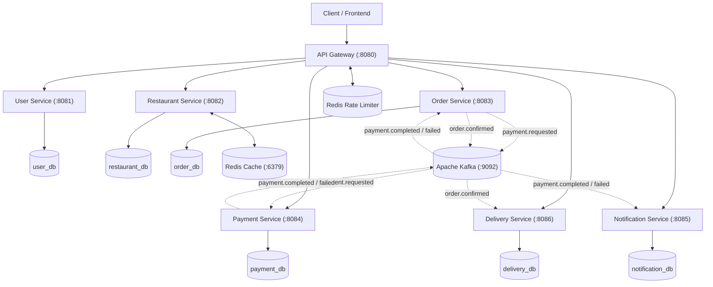

# FoodFlow Architecture

## Overview
FoodFlow is a placement-focused, distributed food delivery backend system built with Java 17, Spring Boot, Spring Cloud Gateway, PostgreSQL, Apache Kafka, and Redis.

## Architectural Principles

1. **Microservices Architecture**: The system is partitioned into domain-specific, independently deployable services (User, Restaurant, Order, Payment, Delivery, Notification, and API Gateway).
2. **Database-per-Service Pattern**: Each service owns its private logical PostgreSQL database schema. Cross-service database access is strictly prohibited.
3. **Decentralized Stateless Security**: The API Gateway routes requests transparently; each downstream service independently validates JWT signatures and enforces domain authorization using Spring Security.
4. **Event-Driven Choreography Saga**: Asynchronous state coordination across Order, Payment, Notification, and Delivery services is managed via Apache Kafka event topics with distinct consumer groups.
5. **Cache-Aside Caching**: High-read restaurant and menu queries leverage Redis caching with automatic database fallback and cache invalidation on mutations.
6. **Optimistic Concurrency Control**: Critical resource allocation (driver assignment) is protected against race conditions using JPA `@Version` optimistic locking.

---

## High-Level Architecture Diagram

> [!NOTE]
> `Order Service` communicates with `Restaurant Service` synchronously via REST (`RestTemplate`) solely to snapshot menu item prices and verify restaurant ownership during order placement and status updates. It has **no** direct connection to Redis.

---

## Service Inventory

| Service | Port | Database | Primary Responsibility |
| :--- | :---: | :---: | :--- |
| **api-gateway** | `8080` | None | Reverse proxy, request routing, rate limiting (`/api/auth/login`), `X-Correlation-Id` tracing. |
| **user-service** | `8081` | `user_db` | User registration, authentication, address book, BCrypt hashing, and stateless JWT token issuance. |
| **restaurant-service** | `8082` | `restaurant_db` | Restaurant onboarding, menu management, and Redis Cache-Aside with PostgreSQL fallback. |
| **order-service** | `8083` | `order_db` | Order creation, price snapshotting, 8-state machine transitions, and Kafka event publishing. |
| **payment-service** | `8084` | `payment_db` | Mock payment processing, PostgreSQL unique constraint idempotency, and Kafka event publishing. |
| **notification-service** | `8085` | `notification_db` | Kafka fan-out consumer (`payment.completed`, `payment.failed`), user notifications, and event deduplication. |
| **delivery-service** | `8086` | `delivery_db` | Delivery dispatch, driver state management, and JPA `@Version` optimistic locking. |
