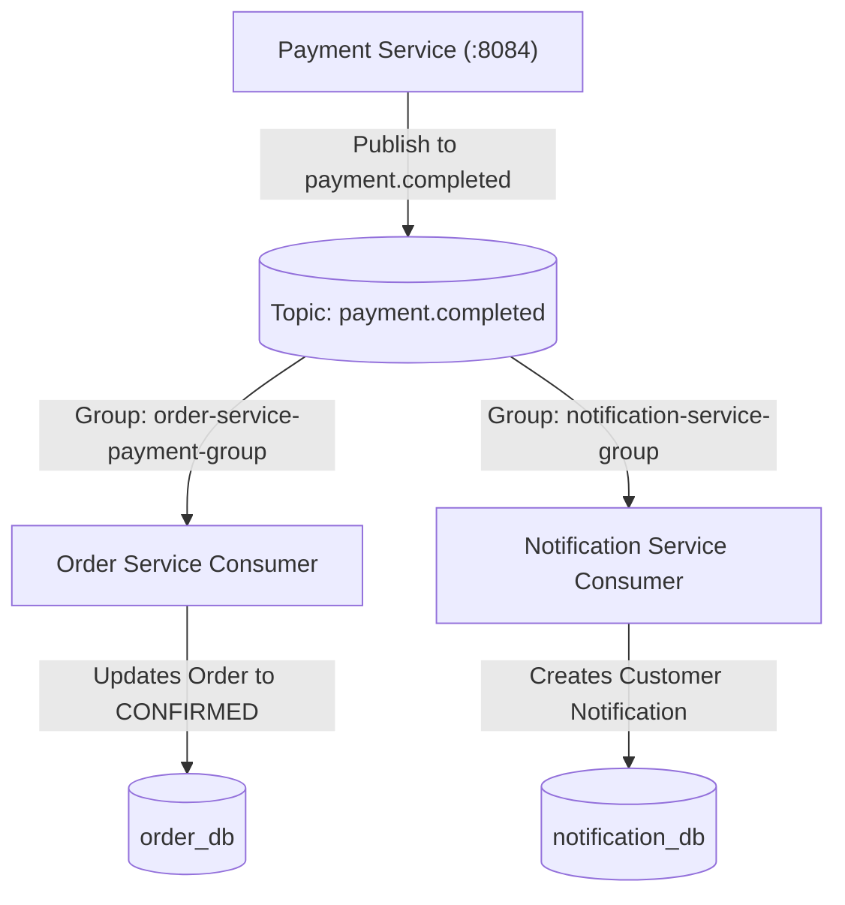

# Event-Driven Architecture with Apache Kafka

FoodFlow leverages Apache Kafka (:9092) for asynchronous event choreography across services, decoupling state transitions and ensuring high fault tolerance.

---

## 1. Kafka Event Catalog

| Topic | Producer Service | Consumer Group | Consumer Service | Payload / Event Class | Purpose |
| :--- | :--- | :--- | :--- | :--- | :--- |
| `payment.requested` | `order-service` | `payment-service-request-group` | `payment-service` | `PaymentRequestedEvent` | Dispatches payment request after order is stored in `order_db`. |
| `payment.completed` | `payment-service` | `order-service-payment-group` | `order-service` | `PaymentCompletedEvent` | Notifies order service that payment succeeded so it can confirm order. |
| `payment.completed` | `payment-service` | `notification-service-group` | `notification-service` | `PaymentCompletedEvent` | **Fan-out:** Notifies customer of successful order payment. |
| `payment.failed` | `payment-service` | `order-service-payment-group` | `order-service` | `PaymentFailedEvent` | Triggers order status transition to `PAYMENT_FAILED`. |
| `payment.failed` | `payment-service` | `notification-service-group` | `notification-service` | `PaymentFailedEvent` | **Fan-out:** Alerts customer of payment decline. |
| `order.confirmed` | `order-service` | `delivery-service-group` | `delivery-service` | `OrderConfirmedEvent` | Initiates delivery dispatch after order confirmation. |

---

## 2. Event Payloads (JSON Schemas)

### `PaymentRequestedEvent` (`payment.requested`)
```json
{
  "eventId": "c7a8b9e1-1234-4567-890a-bcdef0123456",
  "orderId": 101,
  "userId": 5,
  "amount": 42.50,
  "idempotencyKey": "pay-order-101-uuid",
  "timestamp": "2026-10-04T18:30:00"
}
```

### `PaymentCompletedEvent` (`payment.completed`)
```json
{
  "eventId": "d8b9c0f2-2345-5678-901b-cdef01234567",
  "orderId": 101,
  "paymentId": 205,
  "amount": 42.50,
  "status": "SUCCESS",
  "timestamp": "2026-10-04T18:30:02"
}
```

### `PaymentFailedEvent` (`payment.failed`)
```json
{
  "eventId": "e9c0d1a3-3456-6789-012c-def012345678",
  "orderId": 101,
  "paymentId": 205,
  "amount": 42.50,
  "failureReason": "Declined due to mock rules or limit",
  "timestamp": "2026-10-04T18:30:02"
}
```

### `OrderConfirmedEvent` (`order.confirmed`)
```json
{
  "eventId": "f0d1e2b4-4567-7890-123d-ef0123456789",
  "orderId": 101,
  "restaurantId": 2,
  "timestamp": "2026-10-04T18:30:03"
}
```

---

## 3. Kafka Fan-Out Architecture

When `payment-service` publishes a `payment.completed` or `payment.failed` event, it is broadcast to two independent consumer groups:



Each consumer group maintains its own committed offsets, ensuring:
1. `order-service` and `notification-service` process messages independently.
2. A processing delay or failure in `notification-service` does not block `order-service` from progressing the order.

---

## 4. Deserialization Strategy
To prevent cross-service Java classpath coupling (`__TypeId__` serialization exceptions common in multi-service Spring Kafka setups), all listeners configure `StringDeserializer` and deserialize the JSON payload manually using Jackson's `ObjectMapper.readValue(payload, EventClass.class)`.
