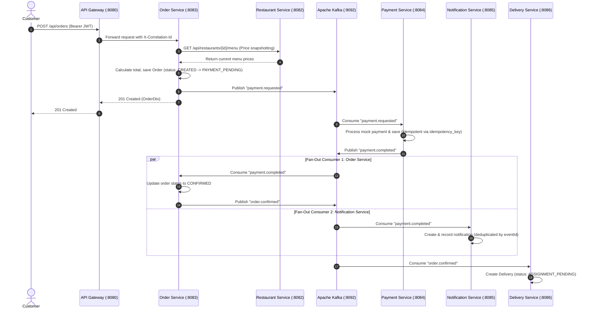

# FoodFlow System Design

## Core Components & Responsibilities

1. **API Gateway (`api-gateway :8080`)**:
   - Single external ingress point for all client requests.
   - Routes requests to downstream microservices using Spring Cloud Gateway.
   - Injects and propagates `X-Correlation-Id` across requests for distributed tracing.
   - Enforces Redis token-bucket rate limiting on `POST /api/auth/login` (5 requests/sec, burst capacity 10).
   - Forwards `Authorization: Bearer <token>` transparently; does **not** validate JWTs directly.

2. **User Service (`user-service :8081`)**:
   - Manages user profiles, credentials, and customer address books.
   - Hashes passwords using BCrypt.
   - Generates stateless HMAC-SHA256 JWT tokens containing `userId`, `role`, and `sub` (email).

3. **Restaurant Service (`restaurant-service :8082`)**:
   - Manages restaurant metadata and menu item catalogs.
   - Enforces owner-only access on restaurant and menu mutations.
   - Implements Redis Cache-Aside pattern on menu lookups with a 10-minute TTL and automatic database fallback upon Redis connection outage.

4. **Order Service (`order-service :8083`)**:
   - Coordinates order creation and order lifecycle.
   - Performs synchronous REST price snapshotting against Restaurant Service to lock in item prices at purchase time.
   - Enforces strict state transitions across 11 order states via an internal state machine.
   - Publishes `payment.requested` and `order.confirmed` Kafka events.

5. **Payment Service (`payment-service :8084`)**:
   - Processes simulated payment transactions.
   - Enforces payment idempotency using a PostgreSQL unique constraint on `idempotency_key`, handling concurrent duplicate attempts gracefully via `DataIntegrityViolationException`.
   - Publishes `payment.completed` and `payment.failed` Kafka events.

6. **Notification Service (`notification-service :8085`)**:
   - Demonstrates Kafka fan-out by consuming `payment.completed` and `payment.failed` events independently using consumer group `notification-service-group`.
   - Records customer notifications with event deduplication based on `eventId`.

7. **Delivery Service (`delivery-service :8086`)**:
   - Consumes `order.confirmed` Kafka events via consumer group `delivery-service-group` to create pending deliveries.
   - Assigns delivery partners using JPA `@Version` optimistic locking to prevent concurrent driver assignment collisions.
   - Enforces a 6-state delivery state machine.

---

## End-to-End Distributed Order Workflow

